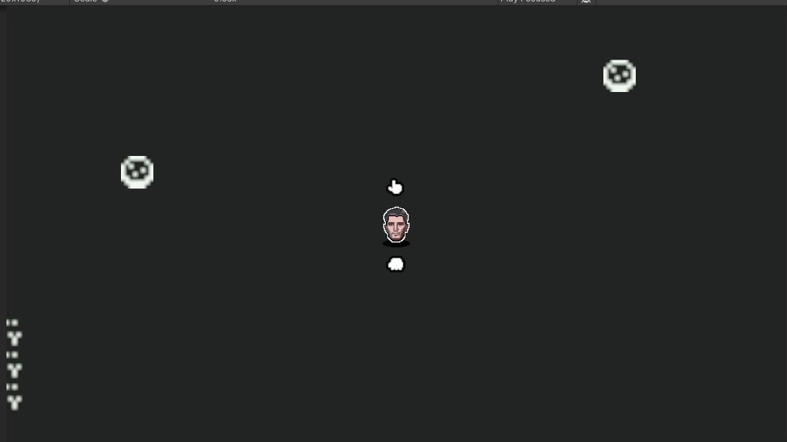
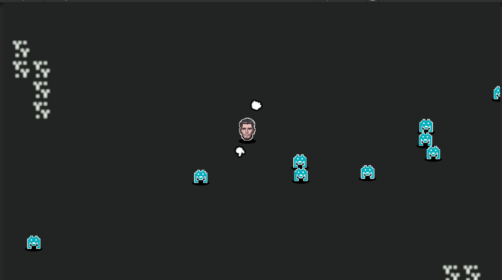
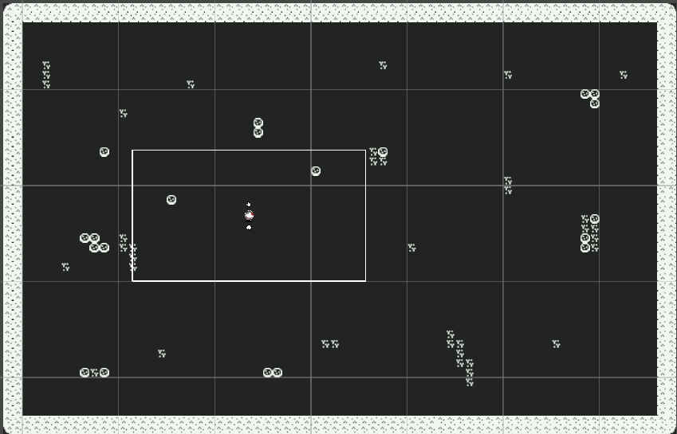
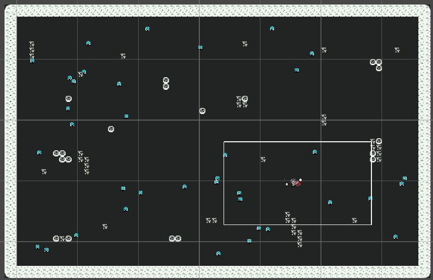

# Lord-Of-The-Horde
Game Project of Game Programming With C# Course
<br>
- Futuregames Academy
- (5 September 2024)
- Teacher referance: <a href="">Martin Andersson</a>

## Assigment 1
### Assigment 1 Description
```
VAMPIRE 1

Features required (G) -
• A player that can move around on the screen
• A enemy that moves independently towards the player
• The enemy can be destroyed
• The player can attack or by input make an enemy be destroyed
• Enemies spawn over time
Lectures relevant that gives basis for all requirements-
Lec 1, 2, 3, 4, 5, 6

Features for distinction (VG) -
• The enemy moves in a meaningful way examples of this;
o Moving towards the player only if the player is in “range”
o Moving towards the player faster if he looks away from the
enemy, and slower if the player looks at them.
o Moving towards the player in a circular pattern
o Tries to dodge the players attacks

Handing in
Hand in GIF’s or video of all requirements on omniway. For distinction and
to reach for VG, also turn in screenshots of movement code for the enemy
and player.

DEADLINE : SEPTEMBER 13
```

<br><b>Screenshots For Development Till Assigment 1</b>

Screenshots           |  Screenshots 
:-------------------------:|:-------------------------:
  |  
  |  

<br><b>Video For Development Till Assigment 1:</b>  
<video src="https://github.com/user-attachments/assets/1362650d-4468-4e34-9784-19760b629662" width=180/></video>


## Assigment 2
### Assigment 2 Description
```
VAMPIRE 2

Features required (G) -
• Abillity to pause the game
• A main menu screen featuring a start button, and a settings menu
• A total of 2 enemy types should be in the game, They should look diffrent and be
diffrent somehow, it could be ex:
o More HP
o Faster movement speed
o Diffrent movement pattern
• Enemies “drop” xp, when an enemy dies the player gets increasingly more xp
• UI for player xp. Could be a text, or a bar.
• The player has a threshold of xp, when that is reached the player “levels up” and
is rewarded somehow, could be ex:
o Faster movement speed
o More hp
o More damage
o Bigger projectiles
o More projectiles
• The camera should follow where the player moves
Lectures relevant that gives basis for all requirementsLec 6, 7, 8, 9, 10, 11

Features for distinction (VG) -
• Game juice!
o Blood fx when enemy dies
o Enemy/Player animations
o UI Animations

Handing in
Hand in GIF’s or video of all requirements on omniway. For distinction and
to reach for VG, also turn in screenshots pause implementation, and new
enemy type.

DEADLINE : SEPTEMBER 27
```

